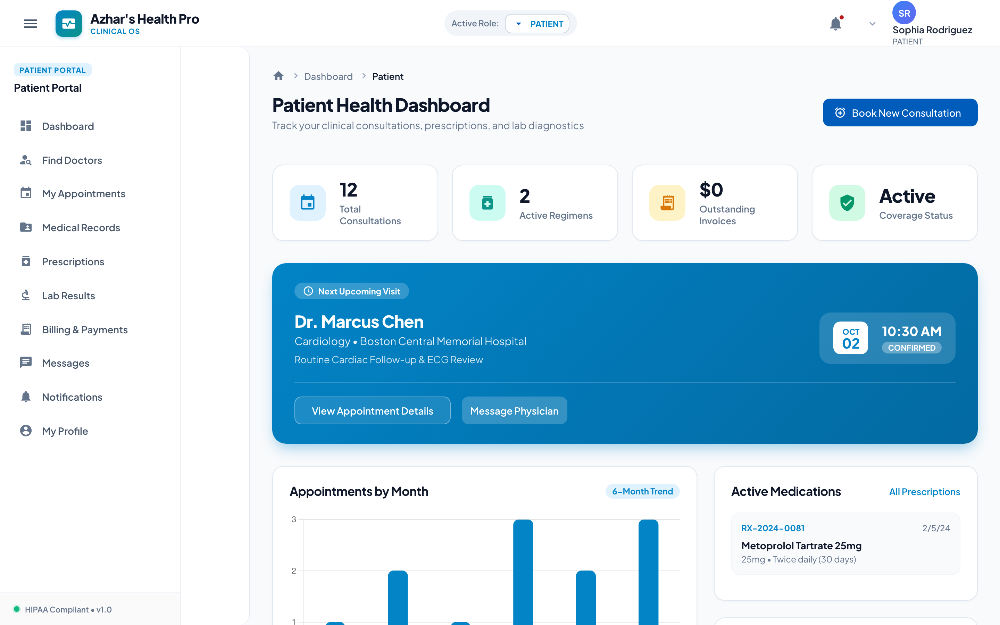
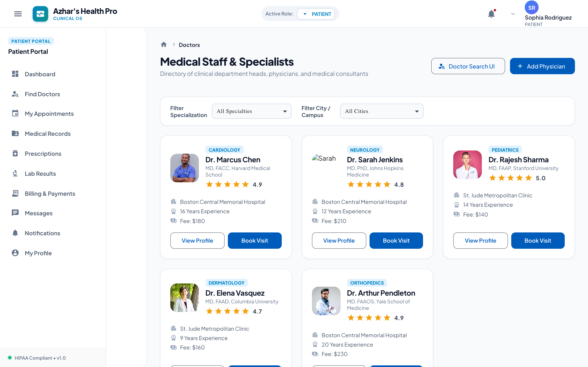
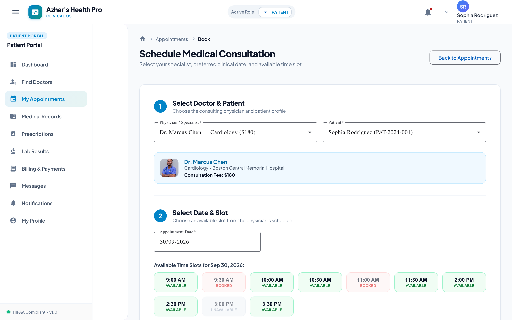
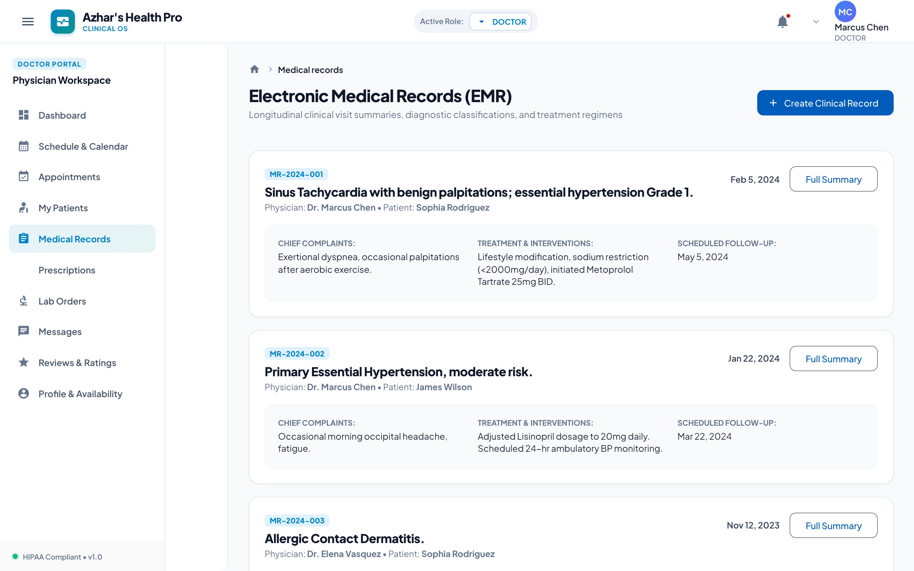
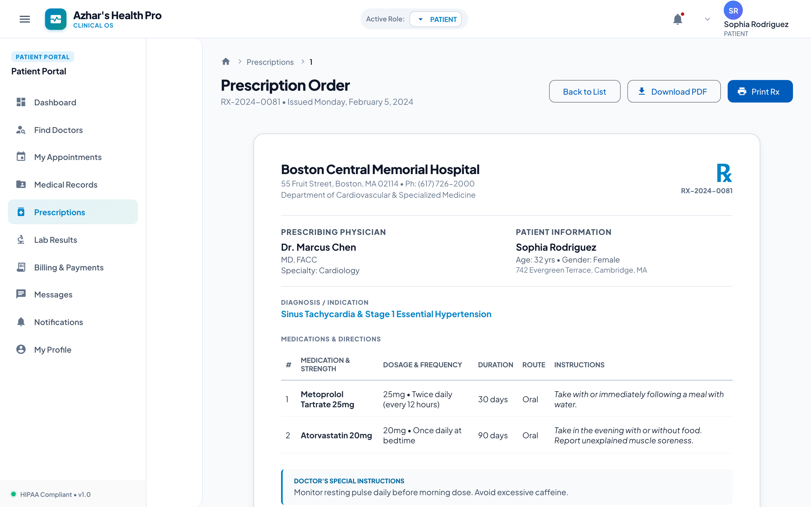
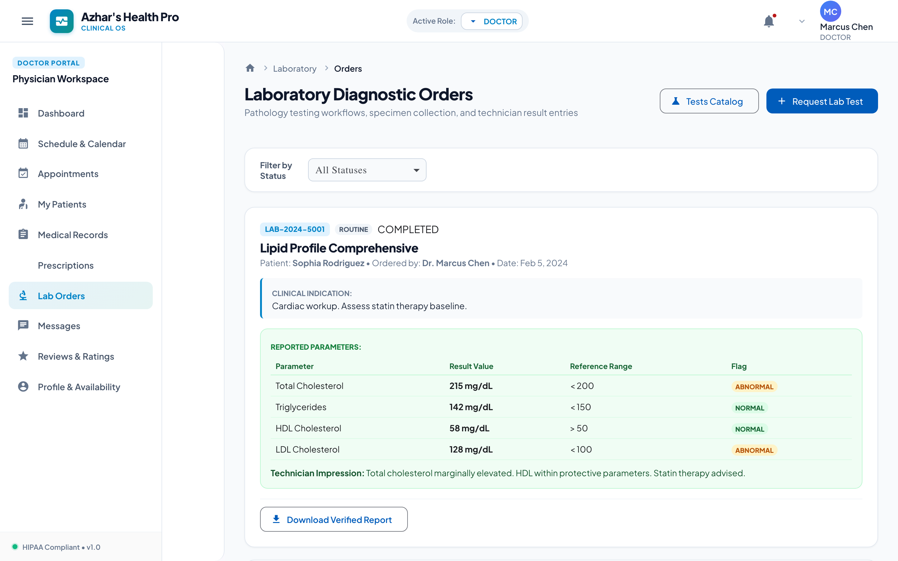
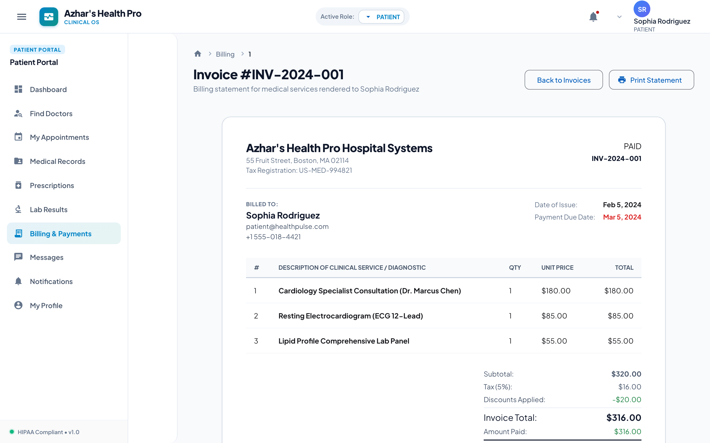
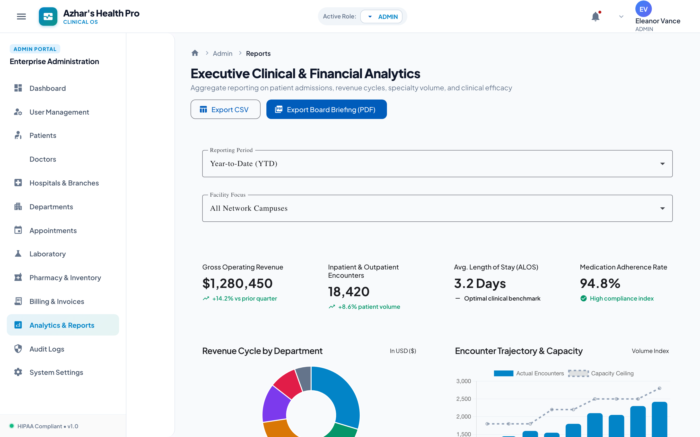
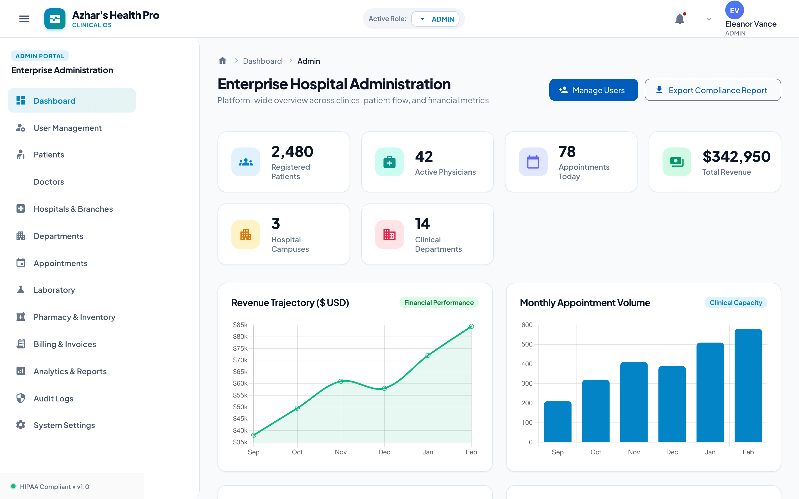

# Azhar's Health Pro — Enterprise Healthcare Management Platform (Angular Frontend)

[](https://angular.dev)
[](https://www.typescriptlang.org/)
[](https://material.angular.io/)
[](https://www.chartjs.org/)
[](https://www.docker.com/)

A modern, production-grade **Electronic Health Records (EHR) & Clinical Operations Platform** built with **Angular 19**, **Angular Signals**, **Angular Material**, **Reactive Forms**, and **Chart.js**. The platform seamlessly consumes a Java Spring Boot REST API (`http://localhost:8080/api/v1`) while including enterprise offline fallbacks for zero-setup demonstration.

---

## 🏥 Platform Overview

Azhar's Health Pro integrates hospital management, patient care delivery, laboratory diagnostics, electronic prescriptions, appointment scheduling, and automated billing into a cohesive, role-governed single page application (SPA).

### Supported Roles & Portals (8 Distinct Personas)
1. **`ADMIN`**: Hospital campus governance, department definitions, staff provisioning, HIPAA audit logs, executive clinical/financial reporting, system configuration.
2. **`DOCTOR`**: Outpatient queue, clinical encounters, EHR creation with vitals recording, multi-medication digital prescriptions (℞), lab test orders, patient review monitoring.
3. **`PATIENT`**: Doctor discovery and filtering, interactive appointment booking with slot collision prevention, digital health records, prescription downloads, diagnostic test results, invoice settlement.
4. **`NURSE`**: Daily encounter triaging, patient vitals recording, pre-consultation notes, appointment status check-in.
5. **`RECEPTIONIST`**: Front-desk scheduling, walk-in patient registration, doctor schedule calendar, appointment status transitions.
6. **`LAB_TECHNICIAN`**: Diagnostic requisition worklist, specimen collection tracking, test result entry with reference ranges, PDF report generation.
7. **`PHARMACIST`**: Digital prescription verification, medication catalog management, batch fulfillment status.
8. **`ACCOUNTANT`**: Multi-method clinical invoice settlement (Cash, Credit Card, UPI, Bank Transfer), revenue reconciliation, overdue invoice alerts.

---

## 📸 Platform Screenshots / UI Gallery

Explore high-resolution visual captures from **Azhar's Health Pro**, highlighting its modern glassmorphism design, clinical workflows, and multi-persona interfaces:

### 1. 📊 Patient Health Dashboard
> Real-time health metrics, upcoming doctor visits, Chart.js clinical trends, and rapid action triggers.



---

### 2. 👨‍⚕️ Specialist Directory & Doctor Discovery
> Advanced medical directory with specialty filter chips, hospital tags, consultation fees, and verified patient reviews.



---

### 3. 🗓️ Multi-Step Appointment Booking
> Intuitive consultation booking stepper with interactive date picker, real-time slot conflict prevention, and visit reason memo.



---

### 4. 📁 Electronic Health Records (EHR)
> Tabbed clinical records index detailing diagnoses, attending physicians, encounter vitals, and visit timelines.



---

### 5. ℞ Printable Digital Prescription Sheet
> Official hospital prescription document featuring patient vitals, diagnosis, multi-medication dosage schedules, and doctor's signature.



---

### 6. 🧪 Diagnostic Laboratory Orders
> Laboratory requisition worklist tracking test specimens, clinical urgency tags, reference ranges, and diagnostic reports.



---

### 7. 💳 Medical Invoice & Billing Statement
> Itemized clinical invoice detailing consultation fees, diagnostics, tax calculations, discounts, and payment settlement actions.



---

### 8. 📈 Hospital Administration & Analytics
> Executive reporting suite with Chart.js monthly revenue trajectories, patient census metrics, and department breakdowns.



---

### 9. 🔐 Clinical Portal Authentication
> Enterprise dual-pane login portal with quick-access role switcher for all 8 hospital personas.



---

## 🛠 Technology Stack

- **Framework**: Angular 19.2+ (Standalone Components, Zoneless-compatible Signals architecture)
- **Language**: TypeScript 5.7+ with strict type checking
- **Design System & Components**: Angular Material 19.2 (Azure & Slate Blue clinical theme, custom glassmorphism)
- **Styling**: SCSS with CSS Custom Properties (Tokens for light/dark clinical aesthetics, WCAG AAA compliant contrast)
- **Data Visualization**: Chart.js 4.5+ (Clinical volume trends, revenue cycle doughnut, encounter trajectories)
- **State & Reactivity**: Angular Signals (`currentUser`, `selectedRole`, `activePortal`) + RxJS 7.8 (debounced searches, HTTP pipelines)
- **Forms**: Angular Reactive Forms with comprehensive validation (regex email, strong password, date bounds, FormArray dynamic prescriptions)
- **HTTP Client**: Angular `provideHttpClient` with functional `authInterceptor` (automatic Bearer token attachment, 401/403/500 centralized error handling)
- **Routing**: Angular Router with lazy-loaded feature modules, route guards (`authGuard`, `guestGuard`, `roleGuard`), dynamic breadcrumbs
- **Testing**: Jasmine & Karma Unit Tests, Playwright End-to-End Test Suite

---

## 🏛 Architecture & Project Structure

```
healthcare-platform-frontend/
├── src/
│   ├── app/
│   │   ├── core/                        # Singleton core infrastructure
│   │   │   ├── constants/               # API endpoints & role-based navigation configs
│   │   │   │   ├── api-endpoints.ts
│   │   │   │   └── navigation.constant.ts
│   │   │   ├── guards/                  # Route protection & role authorization
│   │   │   │   ├── auth.guard.ts
│   │   │   │   ├── auth.guard.spec.ts
│   │   │   │   └── role.guard.ts
│   │   │   ├── interceptors/            # JWT token attachment & HTTP error interception
│   │   │   │   └── auth.interceptor.ts
│   │   │   ├── models/                  # Domain TypeScript interfaces (matched with Spring Boot DTOs)
│   │   │   │   ├── user.model.ts
│   │   │   │   ├── patient.model.ts
│   │   │   │   ├── doctor.model.ts
│   │   │   │   ├── appointment.model.ts
│   │   │   │   ├── medical-record.model.ts
│   │   │   │   ├── prescription.model.ts
│   │   │   │   ├── laboratory.model.ts
│   │   │   │   ├── billing.model.ts
│   │   │   │   ├── hospital.model.ts
│   │   │   │   ├── document.model.ts
│   │   │   │   ├── notification.model.ts
│   │   │   │   ├── message.model.ts
│   │   │   │   ├── review.model.ts
│   │   │   │   ├── dashboard.model.ts
│   │   │   │   ├── audit-log.model.ts
│   │   │   │   └── index.ts
│   │   │   └── services/                # Enterprise HTTP API Services (18 services)
│   │   │       ├── auth.service.ts
│   │   │       ├── user.service.ts
│   │   │       ├── patient.service.ts
│   │   │       ├── doctor.service.ts
│   │   │       ├── appointment.service.ts
│   │   │       ├── medical-record.service.ts
│   │   │       ├── prescription.service.ts
│   │   │       ├── laboratory.service.ts
│   │   │       ├── pharmacy.service.ts
│   │   │       ├── billing.service.ts
│   │   │       ├── hospital.service.ts
│   │   │       ├── document.service.ts
│   │   │       ├── notification.service.ts
│   │   │       ├── notification-toast.service.ts
│   │   │       ├── message.service.ts
│   │   │       ├── review.service.ts
│   │   │       ├── dashboard.service.ts
│   │   │       ├── audit-log.service.ts
│   │   │       └── index.ts
│   │   ├── layout/                      # Application shell
│   │   │   ├── header/                  # Topbar, notifications, demo role switcher, user menu
│   │   │   ├── sidebar/                 # Responsive collapsible navigation
│   │   │   ├── breadcrumbs/             # Dynamic route-based breadcrumbs
│   │   │   └── main-layout/             # MatSidenavContainer shell
│   │   ├── shared/                      # Reusable UI components & dialogs
│   │   │   ├── components/
│   │   │   │   ├── loading-spinner/     # Glassmorphic pulse loader
│   │   │   │   ├── empty-state/         # Empty list feedback
│   │   │   │   ├── error-state/         # Retryable error card
│   │   │   │   ├── star-rating/         # Interactive & readonly star rating
│   │   │   │   ├── data-table/          # Search, sort, paginate MatTable with badges
│   │   │   │   └── file-upload/         # Drag-and-drop file uploader with progress
│   │   │   ├── dialogs/
│   │   │   │   ├── confirm-dialog/      # Generic confirmation modal
│   │   │   │   └── payment-dialog/      # Multi-method clinical settlement dialog
│   │   │   ├── pipes/                   # FileSize, StatusLabel, TimeAmPm
│   │   │   └── index.ts
│   │   ├── features/                    # Lazy-loaded feature modules (15 domains)
│   │   │   ├── auth/                    # Login, Register, Forgot Password, Reset Password
│   │   │   ├── dashboard/               # Patient, Doctor, and Admin Dashboards with Chart.js
│   │   │   ├── patients/                # Patient List, Details (tabbed EHR), Create/Edit Form
│   │   │   ├── doctors/                 # Doctor Search (filters & chips), List, Details, Form
│   │   │   ├── appointments/            # Booking flow, List, Details, Interactive Calendar
│   │   │   ├── medical-records/         # Records List, Encounter Details (vitals), Record Form
│   │   │   ├── prescriptions/           # Prescriptions List, Printable ℞ Details, Form (FormArray)
│   │   │   ├── laboratory/              # Lab Orders workflow, Test Catalog, Results Viewer
│   │   │   ├── pharmacy/                # Medication Catalog & Formulary
│   │   │   ├── billing/                 # Invoices List, Printable Invoice Sheet, Payments
│   │   │   ├── notifications/           # Notification Center with mark-read & filters
│   │   │   ├── messages/                # Dual-pane doctor-patient secure messaging UI
│   │   │   ├── reviews/                 # Verified patient consultation reviews & star ratings
│   │   │   ├── profile/                 # Profile editor, password change, photo upload
│   │   │   └── admin/                   # Users, Hospitals, Departments, Audit Logs, Reports, Settings
│   │   ├── app.config.ts                # Application providers (Router, Interceptor, Animations)
│   │   ├── app.routes.ts                # Root lazy routes configuration
│   │   └── app.component.ts             # Root router outlet host
│   ├── environments/                    # Environment configurations
│   │   ├── environment.ts
│   │   ├── environment.development.ts
│   │   └── environment.production.ts
│   ├── index.html                       # Plus Jakarta Sans & Material Symbols fonts
│   ├── main.ts                          # Bootstrap application
│   └── styles.scss                      # Global design system & theme tokens
├── e2e/                                 # Playwright E2E test suites (15 flows)
│   └── healthcare-platform.spec.ts
├── Dockerfile                           # Multi-stage production container build
├── nginx.conf                           # Nginx production configuration with SPA fallback
├── docker-compose.yml                   # Container orchestration
└── angular.json                         # Workspace configuration with budget adjustments
```

---

## 🚀 Getting Started

### Prerequisites
- **Node.js**: v18.19.0 or v20.x or v22.x
- **NPM**: v9.x or v10.x
- **Java Spring Boot API** (optional): Running at `http://localhost:8080/api/v1`

### 1. Installation
Clone the repository and install all dependencies:
```bash
cd healthcare-platform-frontend
npm install
```

### 2. Running Locally (Development Mode)
Start the Angular development server:
```bash
npm start
# or
ng serve --port 4200
```
Open your browser and navigate to: **`http://localhost:4200`**

> **Instant Demo Tip**: Azhar's Health Pro includes built-in demo credentials on the login screen. Click any role badge (**Patient**, **Doctor**, **Admin**, **Lab Tech**, **Pharmacist**, **Accountant**) to instantly populate credentials and experience that role's tailored portal!

---

## ⚙️ Environment Configuration

Environment files configure the Spring Boot backend REST API base URL:

### `src/environments/environment.development.ts`
```typescript
export const environment = {
  production: false,
  apiUrl: 'http://localhost:8080/api/v1',
  appName: "Azhar's Health Pro (Dev)",
  tokenKey: 'healthpulse_auth_token',
  userKey: 'healthpulse_user_data'
};
```

### `src/environments/environment.production.ts`
```typescript
export const environment = {
  production: true,
  apiUrl: '/api/v1', // Proxied via Nginx in Docker or your ingress controller
  appName: "Azhar's Health Pro",
  tokenKey: 'healthpulse_auth_token',
  userKey: 'healthpulse_user_data'
};
```


---

## 🧪 Testing Strategy

### Unit Tests (Jasmine & Karma)
Run all unit tests:
```bash
npm test
# Run headless once:
npx ng test --watch=false --browsers=ChromeHeadless
```
Test coverage spans:
- `AuthService`: Authentication lifecycle, JWT decoding, Signal reactivity, role redirection.
- `PatientService`: Pagination, query filtering, error fallback handling.
- `DoctorService`: Specialist query filters, slot generation.
- `AppointmentService`: Booking constraints, status progression.
- `LoginComponent`: Form validation, submit handling, quick-role buttons.
- `PatientListComponent`: Data table integration, search triggers.
- `RouteGuards`: `authGuard` and `roleGuard` authorization checks.

### End-to-End Tests (Playwright)
Run the 15 mandated clinical flows in `e2e/healthcare-platform.spec.ts`:
```bash
# Run Playwright tests:
npx playwright test
```
The test suite covers:
1. Patient Registration
2. Patient Login & Dashboard
3. Doctor Discovery & Specialty Filter
4. Appointment Booking (Slot Selector)
5. Appointment Cancellation
6. Doctor Portal Authentication
7. Doctor Daily Schedule Review
8. Doctor EHR Encounter Creation
9. Doctor Multi-item Digital Prescription Creation (FormArray)
10. Patient Printable ℞ Review & PDF Download
11. Diagnostic Order Requisition
12. Laboratory Results Review with Normal Bounds
13. Clinical Invoice Calculation
14. Multi-Method Invoice Settlement (UPI / Card)
15. Safe Logout & Session Invalidation

---

## 🐳 Docker Deployment

### Multi-Stage Container Build
Build and run the production container:
```bash
docker build -t azhars-health-pro-frontend:latest .
docker run -d -p 4200:80 --name azhars-health-pro azhars-health-pro-frontend:latest
```

### Docker Compose
Run the entire frontend using `docker compose`:
```bash
docker compose up -d
```
The application will be served via high-performance Nginx with:
- Gzip compression on all static assets
- 1-year immutable caching for bundles
- Full SPA client-side routing fallback (`try_files $uri $uri/ /index.html;`)
- Hardened security headers (`X-Frame-Options`, `X-XSS-Protection`, `X-Content-Type-Options`)

---

## 📦 Production Build

To produce an optimized production bundle:
```bash
npm run build -- --configuration production
```
Compiled output is saved to `dist/healthcare-platform-frontend/browser` with:
- Full Ahead-of-Time (AOT) compilation
- Tree-shaking and minification
- Initial chunk size ~175 kB transfer size
- Lazy-loaded route chunks for fast initial load times
